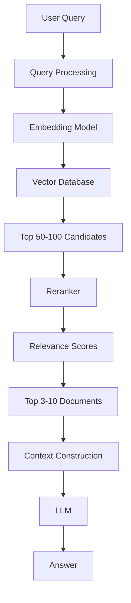
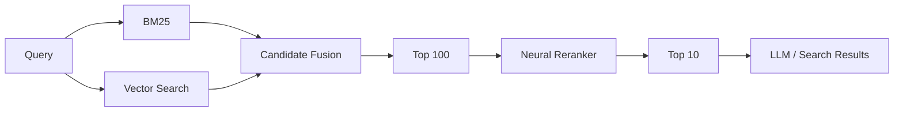

<p align="center">
  <a href="https://github.com/ishandutta2007/Awesome-Reranking-API">
    
  </a>
</p>

# 🔄 Awesome Reranking API: Top Neural Rerankers, Hosted APIs & Cross-Encoders for RAG 🚀

<p align="center">
  <a href="https://github.com/ishandutta2007/Awesome-Awesome-Awesome"></a><a href="https://discord.gg/jc4xtF58Ve"></a> <a href="https://github.com/ishandutta2007/Awesome-Reranking-API/stargazers"></a> <a href="https://github.com/ishandutta2007/Awesome-Reranking-API/network/members"></a> <a href="https://github.com/ishandutta2007/Awesome-Reranking-API/issues"></a> <a href="https://github.com/ishandutta2007/Awesome-Reranking-API/blob/main/LICENSE"></a> <a href="https://github.com/ishandutta2007"></a>
</p>

> 🌟 **The Definitive Directory of Neural Reranking APIs, Hosted Inference Platforms, Cross-Encoders, ColBERT Late Interaction, and Open-Source Ranking Models for High-Precision Retrieval-Augmented Generation (RAG) & Semantic Search.**

Rerankers serve as the vital **second-stage retrieval layer** in production AI systems: an initial retriever (like BM25 keyword search or dense vector embeddings) surfaces an over-inclusive candidate pool (top 50–100), and a high-precision neural reranker jointly evaluates query-document pairs to output a finely re-ordered, hyper-relevant top 3–10 set for LLM context injection.

---
## 📑 Table of Contents


* [☁️ SaaS/Hosted Platforms](#️-saashosted-platforms)

* [🌍 Open-Source](#-open-source)

* [🎯 Open-Source Reranking Models](#-open-source-reranking-models)

* [🧠 Open-Source Cross-Encoder Rerankers](#-open-source-cross-encoder-rerankers)

* [🔤 Open-Source Multilingual Rerankers](#-open-source-multilingual-rerankers)

* [⚡ Lightweight & CPU Rerankers](#-lightweight--cpu-rerankers)

* [🔢 Open-Source ColBERT Rerankers](#-open-source-colbert-rerankers)

* [🤖 Open-Source LLM Rerankers](#-open-source-llm-rerankers)

* [📝 Open-Source T5 Rerankers](#-open-source-t5-rerankers)

* [🖼️ Open-Source Multimodal Rerankers](#️-open-source-multimodal-rerankers)

* [🛠️ Open-Source Reranking Libraries](#️-open-source-reranking-libraries)

* [🔍 Open-Source Search Engines with Reranking](#-open-source-search-engines-with-reranking)

* [🧩 Commercial Platform → Open-Source Equivalent](#-commercial-platform--open-source-equivalent)

* [🏗️ Reranking Architecture](#️-reranking-architecture)

* [🔄 Open-Source RAG Reranking Architecture](#-open-source-rag-reranking-architecture)

* [⚖️ Commercial vs Open-Source](#️-commercial-vs-open-source)

* [🚀 Recommended Open-Source Stacks](#-recommended-open-source-stacks)

* [📊 Reranker Technology Comparison](#-reranker-technology-comparison)

* [🎯 Recommended Projects by Use Case](#-recommended-projects-by-use-case)

* [🏢 Building a Cohere Rerank Alternative](#-building-a-cohere-rerank-alternative)

* [🌐 Open-Source Reranking Landscape](#-open-source-reranking-landscape)

* [🧠 Why Reranking Matters](#-why-reranking-matters)

* [🤝 Contributing](#-contributing)

* [⚠️ Disclaimer](#️-disclaimer)


---


# ☁️ SaaS/Hosted Platforms

Hosted reranking APIs provide managed, production-grade neural inference with zero GPU infrastructure management, automatic scaling, and enterprise SLAs.

> 📊 **Sector Market Size & Dynamics:** The global AI search, neural reranking, and RAG retrieval infrastructure sector is estimated at **~$5.2 Billion in 2026** (projected to reach **$18+ Billion by 2030** at a ~28% CAGR). The sector is **moderately fragmented**: while hyperscale cloud providers (NVIDIA, Google Cloud, AWS) dominate high-volume enterprise pipelines, specialized neural retrieval pure-plays (Cohere, Voyage AI, Jina AI, Mixedbread, Pinecone) maintain strong differentiation through proprietary domain cross-encoders, multimodal capabilities, and superior price-performance, preventing a winner-take-all monopoly.

| Platform | Company | Company Size (Valuation / Market Cap) | Pricing | Free Tier Limit | Primary Focus | Key Capabilities |
| :--- | :--- | :--- | :--- | :--- | :--- | :--- |
| [NVIDIA NeMo Retriever](https://developer.nvidia.com/nemo-retriever) | NVIDIA | ~$3.0 Trillion Market Cap (NASDAQ: NVDA) | $1.00 / GPU hour (cloud marketplace pay-as-you-go) or $4,500 / GPU/year (NVIDIA AI Enterprise) | 1,000 free API credits (expandable to 5,000) on build.nvidia.com; 90-day AI Enterprise evaluation license | Enterprise retrieval | Embedding, reranking and retrieval optimization |
| [Google Vertex AI Ranking](https://cloud.google.com/vertex-ai) | Google Cloud | ~$2.2 Trillion Alphabet Market Cap (NASDAQ: GOOGL) | $1.00 / 1,000 queries (up to 100 documents per query) | 90-day free trial with $300 credits; monthly free allowance of 80,000 ranking units (or 10,000 queries/month on Agent Search) | Enterprise ranking | Ranking and retrieval optimization for search/RAG |
| [Amazon Bedrock Rerank](https://aws.amazon.com/bedrock/) | Amazon Web Services | ~$2.0 Trillion Amazon Market Cap (NASDAQ: AMZN) | $1.00 / 1,000 queries (Amazon Rerank 1.0); $2.00 / 1,000 queries (Cohere Rerank 3.5) | AWS Free Tier / promotional starter credits ($200 AWS credit for new accounts, valid for 12 months) | Managed RAG retrieval | Native Knowledge Bases integration, semantic filtering |
| [OpenSearch Neural Search](https://opensearch.org/) | OpenSearch / AWS | ~$2.0 Trillion AWS Ecosystem ($105B+ AWS Parent Rev) | $0.036 / hour (~$26.00 / month for t3.small.search managed AWS instance) | AWS Free Tier: 750 hours/month of t2/t3.small.search + 10 GB EBS storage free for 12 months | Search + neural retrieval | Neural search, hybrid retrieval and reranking |
| [Elastic](https://www.elastic.co/) | Elastic | ~$9.0 Billion Market Cap (NYSE: ESTC) | $95.00 / month (Standard tier); $131.00 / month (Platinum tier with native cross-encoder reranking) | 14-day free trial with full access to search and ML reranking features (1 deployment, up to 3 projects) | Search relevance | Semantic search, hybrid search and reranking |
| [Cohere Rerank](https://cohere.com/rerank) | Cohere | ~$5.5 Billion Valuation (Series D) | $2.00 / 1,000 searches ($0.002/search) | Free trial API key: 1,000 requests/month (rate limit 10 RPM, non-production) | General-purpose reranking | Multilingual reranking, search, RAG and semi-structured data |
| [Hugging Face Inference](https://huggingface.co/inference-api) | Hugging Face | ~$4.5 Billion Valuation (Series D) | $9.00 / month (PRO subscription); Dedicated Endpoints from $0.06/hr (CPU), $0.50/hr (GPU) | Serverless API: Free forever (~1,000 requests/day, models <10B); $0.10/month credit for providers | Model inference | Hosted inference for open reranking models |
| [Cerebras](https://www.cerebras.ai/) | Cerebras | ~$4.0 Billion Valuation (Pre-IPO) | $0.10 / 1M tokens (Developer tier, $10 minimum deposit; Llama 3.1 8B at $0.10/1M tokens) | Free forever plan: 1,000,000 tokens/day (resets every 24 hours, 30 RPM, no credit card required) | Fast AI inference | High-throughput inference for custom reranking workloads |
| [Together AI](https://www.together.ai/) | Together AI | ~$1.25 Billion Valuation (Series B Unicorn) | $0.10 / 1M tokens ($5.00 minimum deposit; dedicated GPU instances from $0.90/hour) | $5.00 free credit on signup for API evaluation (60 RPM rate limit) | Model inference | Hosted inference for open reranking models |
| [Pinecone Rerank](https://www.pinecone.io/) | Pinecone | ~$1.20 Billion Valuation (Series B Unicorn) | $2.00 / 1,000 requests (Standard plan, $50/month minimum commitment) | Starter plan: 500 rerank requests/month free forever (1 project, 2 GB storage in AWS us-east-1) | Managed retrieval | Reranking integrated with vector search and RAG |
| [Fireworks AI](https://fireworks.ai/) | Fireworks AI | ~$552 Million Valuation (Series B) | $0.10 / 1M tokens (sub-4B models); $0.20 / 1M tokens (4B–16B models) | $1.00 free credit upon signup for serverless inference testing (rate limited) | Model inference | Hosted inference for open models and custom retrieval stacks |
| [Voyage AI Rerank](https://www.voyageai.com/) | Voyage AI | ~$100 Million Valuation (Series A) | $0.02 / 1M tokens (rerank-3-lite); $0.05 / 1M tokens (rerank-3) | 200 million free tokens upon sign-up (applicable to rerank-3 / rerank-3-lite, 3 RPM) | High-quality retrieval | Reranking, retrieval optimization and domain-oriented models |
| [Jina AI Reranker](https://jina.ai/reranker/) | Jina AI | ~$80 Million Valuation (Series A) | $0.05 / 1M tokens ($50 for 1B tokens top-up bundle) | 10 million free tokens upon key generation (shared pool, 500 RPM / 1M TPM, non-commercial) | Multilingual reranking | Text reranking, multilingual retrieval and long-context use cases |
| [Mixedbread AI](https://www.mixedbread.com/) | Mixedbread | ~$20 Million Valuation (Seed) | $2.50 / 1,000 queries (Toast 1 with Reranking) or $3.50 / 1,000 queries (rerank add-on; Scale plan: $20/month) | Starter plan: $5.00 free credits upon signup (100 RPM, no credit card required) | Retrieval models | Embedding and reranking APIs |
| [ZeroEntropy](https://zeroentropy.dev/) | ZeroEntropy | ~$10 Million Valuation (Seed) | $0.025 / 1M tokens (zerank-2) or $50.00 / month for Team tier | Free forever plan: 500,000 UTF-8 bytes/minute rate limit in fast mode (no credit card required) | Ultra-fast reranking | Sub-millisecond latency reranking, high-throughput batch scoring |
| [Ragatouille](https://github.com/bclavie/RAGatouille) | Answer.AI / community ecosystem | ~$10 Million Seed R&D Lab | $0.00 (Open-Source library; self-host on cloud compute from ~$0.03/hr) | Free forever (Apache-2.0 license, unlimited local and self-hosted execution) | ColBERT retrieval | ColBERT-based retrieval and reranking |
| [Rerankers](https://github.com/AnswerDotAI/rerankers) | AnswerDotAI / community ecosystem | ~$10 Million Seed R&D Lab | $0.00 (Open-Source library; self-host on cloud compute from ~$0.03/hr) | Free forever (Apache-2.0 license, unlimited local and self-hosted execution) | Unified Reranking API | Hosted & local reranking infrastructure and unified API wrapper |

> 📌 **Note:** Reranking pricing and feature offerings evolve rapidly. Always evaluate candidate throughput, batch sizes, and token context limits when projecting production inference economics.


---

# 🌍 Open-Source


The open-source reranking ecosystem can be divided into several major approaches:


```text

                         RERANKING

                            │

       ┌────────────────────┼────────────────────┐

       │                    │                    │

       ▼                    ▼                    ▼

  Cross-Encoder          ColBERT             LLM Ranking

       │                    │                    │

       ▼                    ▼                    ▼

    BGE-Reranker         ColBERT            RankLLM

    Jina Reranker        RAGatouille        RankGPT

    mxbai-rerank         PyLate             RankZephyr

    MonoT5

       │

       ▼

   Fast / Accurate

```


A particularly useful distinction is between:


* **Pointwise reranking** — score each candidate independently.

* **Pairwise reranking** — compare candidates.

* **Listwise reranking** — rank an entire candidate list.

* **Cross-encoder reranking** — jointly encode query + document.

* **ColBERT-style late interaction** — independently encode tokens and perform efficient interaction.

* **LLM reranking** — use generative language models to reason over candidate documents.


---


# 🎯 Open-Source Reranking Models

The open-source reranking ecosystem offers competitive alternatives to proprietary APIs, with full model-weight transparency and zero data exfiltration risks.

| Model / Project | Stars | Architecture | Primary Strength |
| :--- | :---: | :--- | :--- |
| [Sentence Transformers](https://github.com/UKPLab/sentence-transformers) | [](https://github.com/UKPLab/sentence-transformers/stargazers) | Cross-Encoder | Broadest cross-encoder model ecosystem & HuggingFace integration |
| [FlagEmbedding (BGE Reranker)](https://github.com/FlagOpen/FlagEmbedding) | [](https://github.com/FlagOpen/FlagEmbedding/stargazers) | Cross-Encoder | State-of-the-art general & multilingual open reranking models |
| [BGE-Reranker-v2-m3](https://huggingface.co/BAAI/bge-reranker-v2-m3) | [](https://github.com/FlagOpen/FlagEmbedding/stargazers) | Cross-Encoder (568M) | Benchmark-leading multilingual reranking (100+ languages) |
| [BGE-Reranker-v2-Gemma](https://huggingface.co/BAAI/bge-reranker-v2-gemma) | [](https://github.com/FlagOpen/FlagEmbedding/stargazers) | LLM / Cross-Encoder | Deep semantic reasoning reranker based on Gemma architecture |
| [RAGatouille](https://github.com/bclavie/RAGatouille) | [](https://github.com/bclavie/RAGatouille/stargazers) | ColBERT Late Interaction | Simplified ColBERTv2 training, indexing, and reranking |
| [ColBERT / ColBERTv2](https://github.com/stanford-futuredata/ColBERT) | [](https://github.com/stanford-futuredata/ColBERT/stargazers) | Late Interaction | Pioneer token-level late-interaction search and reranking architecture |
| [ColPali / ColQwen](https://github.com/illuin-tech/colpali) | [](https://github.com/illuin-tech/colpali/stargazers) | Vision-Language ColBERT | Multimodal document, PDF page, and slide reranking |
| [rerankers](https://github.com/AnswerDotAI/rerankers) | [](https://github.com/AnswerDotAI/rerankers/stargazers) | Unified Wrapper | Unified abstraction over Cross-Encoders, ColBERT, T5, and APIs |
| [FlashRank](https://github.com/PrithivirajDamodaran/FlashRank) | [](https://github.com/PrithivirajDamodaran/FlashRank/stargazers) | ONNX / Cross-Encoder | Ultra-lightweight CPU reranking with sub-10ms latencies |
| [PyLate](https://github.com/lightonai/pylate) | [](https://github.com/lightonai/pylate/stargazers) | ColBERT | Modern, modular library for ColBERT models and PLAID integration |
| [Tevatron](https://github.com/texttron/tevatron) | [](https://github.com/texttron/tevatron/stargazers) | Dense / Cross-Encoder | High-efficiency neural retrieval and reranking training toolkit |
| [RankGPT](https://github.com/sunnweiwei/RankGPT) | [](https://github.com/sunnweiwei/RankGPT/stargazers) | LLM Prompting | Zero-shot sliding-window listwise reranking with LLMs |
| [RankZephyr / RankLLM](https://github.com/castorini/rank_llm) | [](https://github.com/castorini/rank_llm/stargazers) | LLM / T5 Listwise | Production listwise reranking using open LLMs (Zephyr, Vicuna, LiT5) |
| [PyGaggle (MonoT5 / RankT5)](https://github.com/castorini/pygaggle) | [](https://github.com/castorini/pygaggle/stargazers) | T5 Pointwise & Pairwise | Sequence-to-sequence ranking models and evaluation framework |
| [mxbai-rerank](https://huggingface.co/mixedbread-ai) | [](https://huggingface.co/mixedbread-ai) | Cross-Encoder | High-capacity open weights with state-of-the-art MTEB reranking scores |
| [Jina Reranker v2](https://huggingface.co/jinaai) | [](https://huggingface.co/jinaai) | Cross-Encoder | Multilingual, multi-task, and code-aware cross-encoders |


---

# 🧠 Open-Source Cross-Encoder Rerankers


Cross-encoders jointly process the query and candidate document:


```text

Query ───────────┐

                 ├──► Cross-Encoder ──► Relevance Score

Document ────────┘

```


This allows the model to directly evaluate interactions between query and document tokens.


| Model                                                                                                           | Description                               |

| --------------------------------------------------------------------------------------------------------------- | ----------------------------------------- |

| [BAAI/bge-reranker-base](https://huggingface.co/BAAI/bge-reranker-base)                                         | Lightweight BGE cross-encoder             |

| [BAAI/bge-reranker-large](https://huggingface.co/BAAI/bge-reranker-large)                                       | Larger BGE cross-encoder                  |

| [BAAI/bge-reranker-v2-m3](https://huggingface.co/BAAI/bge-reranker-v2-m3)                                       | Multilingual 568M-parameter reranker      |

| [BAAI/bge-reranker-v2-gemma](https://huggingface.co/BAAI/bge-reranker-v2-gemma)                                 | Larger multilingual reranker              |

| [mixedbread-ai/mxbai-rerank-large-v1](https://huggingface.co/mixedbread-ai/mxbai-rerank-large-v1)               | High-capacity reranker                    |

| [mixedbread-ai/mxbai-rerank-base-v1](https://huggingface.co/mixedbread-ai/mxbai-rerank-base-v1)                 | Smaller reranking model                   |

| [jinaai/jina-reranker-v1-turbo-en](https://huggingface.co/jinaai/jina-reranker-v1-turbo-en)                     | Fast English reranker                     |

| [jinaai/jina-reranker-v1-tiny-en](https://huggingface.co/jinaai/jina-reranker-v1-tiny-en)                       | Lightweight English reranker              |

| [Alibaba-NLP/gte-reranker-modernbert-base](https://huggingface.co/Alibaba-NLP/gte-reranker-modernbert-base)     | ModernBERT-based reranking                |

| [Alibaba-NLP/gte-multilingual-reranker-base](https://huggingface.co/Alibaba-NLP/gte-multilingual-reranker-base) | Multilingual reranking                    |

| [maidalun1020/bce-reranker-base_v1](https://huggingface.co/maidalun1020/bce-reranker-base_v1)                   | Bilingual / general reranking             |

| [MS MARCO Cross-Encoders](https://www.sbert.net/docs/pretrained-models/ce-msmarco.html)                         | Large ecosystem of trained ranking models |


The BGE family includes lightweight and larger multilingual rerankers; for example, BGE-Reranker-v2-m3 is documented as a multilingual 568M-parameter cross-encoder.


---


# 🔤 Open-Source Multilingual Rerankers


| Model                                    | Languages / Focus                   |

| ---------------------------------------- | ----------------------------------- |

| **BGE-Reranker-v2-m3**                   | Multilingual                        |

| **BGE-Reranker-v2-Gemma**                | Multilingual                        |

| **BGE-Reranker-v2.5-Gemma2-Lightweight** | Multilingual                        |

| **Jina Reranker**                        | Multilingual                        |

| **GTE Multilingual Reranker**            | Multilingual                        |

| **mxbai-rerank**                         | Primarily English-oriented variants |

| **ColBERT multilingual models**          | Model-dependent                     |

| **XLM-R-based Cross-Encoders**           | Multilingual                        |

| **LaBSE-based ranking models**           | Multilingual                        |


For multilingual retrieval, BGE-Reranker-v2-m3 is one of the most useful open models to evaluate first.


---


# ⚡ Lightweight & CPU Rerankers


Not every application needs a multi-billion-parameter reranker.


| Project                                                                      | Approach      | Strength                       |

| ---------------------------------------------------------------------------- | ------------- | ------------------------------ |

| [FlashRank](https://github.com/PrithivirajDamodaran/FlashRank)               | ONNX          | Very lightweight CPU inference |

| [BGE-Reranker-base](https://huggingface.co/BAAI/bge-reranker-base)           | Cross-Encoder | Smaller BGE model              |

| [Jina Tiny Reranker](https://huggingface.co/jinaai/jina-reranker-v1-tiny-en) | Cross-Encoder | Low resource requirements      |

| [MS MARCO MiniLM](https://huggingface.co/cross-encoder)                      | Cross-Encoder | Fast ranking                   |

| [Sentence Transformers](https://github.com/UKPLab/sentence-transformers)     | Cross-Encoder | Efficient local inference      |

| [ONNX Runtime](https://github.com/microsoft/onnxruntime)                     | Runtime       | Optimized model execution      |


FlashRank is specifically designed around lightweight reranking and ONNX-optimized inference, making it useful when CPU latency and deployment simplicity matter.


---


# 🔢 Open-Source ColBERT Rerankers


ColBERT uses **late interaction** rather than processing the entire query-document pair through one traditional cross-encoder.


```text

                 Query

                   │

                   ▼

             Query Encoder

                   │

             Token Embeddings

                   │

                   ▼

              ┌─────────┐

              │ MaxSim  │

              └────┬────┘

                   │

       ┌───────────┼───────────┐

       ▼           ▼           ▼

    Document A  Document B  Document C

       │           │           │

       └───────────┼───────────┘

                   │

                   ▼

                 Ranking

```


| Project | Stars | Architecture | Description |
| :--- | :---: | :--- | :--- |
| [RAGatouille](https://github.com/bclavie/RAGatouille) | [](https://github.com/bclavie/RAGatouille/stargazers) | ColBERTv2 | Easy ColBERT integration with LangChain, LlamaIndex, and native RAG pipelines |
| [ColBERT / ColBERTv2](https://github.com/stanford-futuredata/ColBERT) | [](https://github.com/stanford-futuredata/ColBERT/stargazers) | Late Interaction | Original compressed late-interaction architecture for fast sub-millisecond retrieval |
| [rerankers](https://github.com/AnswerDotAI/rerankers) | [](https://github.com/AnswerDotAI/rerankers/stargazers) | Multi-Backend | Unified API supporting ColBERT backends alongside cross-encoders |
| [PyLate](https://github.com/lightonai/pylate) | [](https://github.com/lightonai/pylate/stargazers) | ColBERT | Modern Python ColBERT toolkit designed for training and PLAID indexing |
| [Tevatron](https://github.com/texttron/tevatron) | [](https://github.com/texttron/tevatron/stargazers) | Dense / ColBERT | Highly flexible research framework for neural IR and late-interaction models |


---


# 🤖 Open-Source LLM Rerankers


Instead of producing a scalar score directly, an LLM can reason over candidate documents and produce an ordering.


```text

Query

  │

  ▼

Candidate Documents

  │

  ├── Document A

  ├── Document B

  ├── Document C

  ├── Document D

  └── Document E

  │

  ▼

LLM Ranker

  │

  ▼

Ordered Results

```


| Project | Stars | Architecture | Description |
| :--- | :---: | :--- | :--- |
| [vLLM](https://github.com/vllm-project/vllm) | [](https://github.com/vllm-project/vllm/stargazers) | PagedAttention Engine | Ultra-high-throughput engine for serving generative LLM rerankers and cross-encoders |
| [rerankers](https://github.com/AnswerDotAI/rerankers) | [](https://github.com/AnswerDotAI/rerankers/stargazers) | Unified Interface | Unified API wrapper supporting RankGPT, LLM layerwise, and local models |
| [RankGPT](https://github.com/sunnweiwei/RankGPT) | [](https://github.com/sunnweiwei/RankGPT/stargazers) | Zero-Shot LLM | Prompt-based sliding-window listwise reranker using frontier language models |
| [RankLLM (RankZephyr / RankVicuna)](https://github.com/castorini/rank_llm) | [](https://github.com/castorini/rank_llm/stargazers) | Open LLM Listwise | State-of-the-art listwise ranking with open-source Zephyr and Vicuna LLMs |
| [LiT5](https://github.com/castorini/rank_llm) | [](https://github.com/castorini/rank_llm/stargazers) | T5 Encoder-Decoder | Listwise T5 ranking model optimized for long context document sets |


LLM reranking can be particularly useful when relevance requires deeper semantic reasoning, although it generally has higher inference cost and latency than compact cross-encoders.


---


# 📝 Open-Source T5 Rerankers


T5-style models can be trained to predict relevance for query-document pairs or perform listwise ranking.


| Project / Model                                      | Description            |

| ---------------------------------------------------- | ---------------------- |

| [MonoT5](https://github.com/castorini/pygaggle)      | Pointwise T5 reranking |

| [DuoT5](https://github.com/castorini/pygaggle)       | Pairwise T5 reranking  |

| [RankT5](https://github.com/castorini/pygaggle)      | T5 ranking models      |

| [InRanker](https://github.com/AnswerDotAI/rerankers) | T5-based ranking       |

| [LiT5](https://github.com/castorini/rank_llm)        | Listwise T5 reranking  |

| [PyGaggle](https://github.com/castorini/pygaggle)    | Neural ranking toolkit |


---


# 🖼️ Open-Source Multimodal Rerankers


Document and multimodal search increasingly require ranking based on both text and visual information.


| Project / Model                                                 | Description                                       |

| --------------------------------------------------------------- | ------------------------------------------------- |

| [MonoVLMRanker](https://github.com/AnswerDotAI/rerankers)       | Multimodal VLM reranking                          |

| [ColPali](https://github.com/illuin-tech/colpali)               | Vision-language late-interaction retrieval        |

| [ColQwen](https://github.com/illuin-tech/colpali)               | Vision-language retrieval                         |

| [PaliGemma](https://huggingface.co/google/paligemma-3b-mix-448) | Multimodal model usable in custom ranking systems |

| [Qwen-VL](https://github.com/QwenLM/Qwen3-VL)                   | Multimodal reasoning                              |

| [InternVL](https://github.com/OpenGVLab/InternVL)               | Multimodal model family                           |


Multimodal reranking is particularly useful for:


* PDF pages

* Slides

* Charts

* Screenshots

* Product images

* Scanned documents

* Tables

* Visual search


---


# 🛠️ Open-Source Reranking Libraries


## ⭐ Rerankers


[rerankers](https://github.com/AnswerDotAI/rerankers) provides a unified interface across many reranking approaches, including cross-encoders, T5, ColBERT, FlashRank, LLM ranking and several hosted APIs.


```python

from rerankers import Reranker


ranker = Reranker(

    "BAAI/bge-reranker-v2-m3",

    model_type="cross-encoder"

)


results = ranker.rank(

    query="What is retrieval augmented generation?",

    docs=[

        "RAG combines retrieval with language models.",

        "Transformers are neural network architectures.",

        "Vector databases store embeddings."

    ]

)


top_results = results.top_k(3)

```


The library can also switch between local and API-backed rerankers using a common interface.


---


## Sentence Transformers


[Sentence Transformers](https://github.com/UKPLab/sentence-transformers) provides one of the most widely used ecosystems for cross-encoder reranking.


```python

from sentence_transformers import CrossEncoder


model = CrossEncoder(

    "BAAI/bge-reranker-v2-m3"

)


scores = model.predict([

    [

        "What is RAG?",

        "RAG combines retrieval with language models."

    ],

    [

        "What is RAG?",

        "Transformers are neural network architectures."

    ]

])

```


Cross-encoders directly score query-document pairs and are a standard approach for reranking retrieved candidates.


---


## FlagEmbedding


[FlagEmbedding](https://github.com/FlagOpen/FlagEmbedding) provides BGE embeddings and reranking models.


```python

from FlagEmbedding import FlagReranker


reranker = FlagReranker(

    "BAAI/bge-reranker-v2-m3",

    use_fp16=True

)


score = reranker.compute_score([

    "What is RAG?",

    "RAG combines retrieval with language models."

])

```


The BGE project documents dedicated reranking models including BGE-Reranker-v2-m3 and larger multilingual variants.


---


## FlashRank


[FlashRank](https://github.com/PrithivirajDamodaran/FlashRank) is focused on small, fast rerankers and CPU-friendly inference.


Best suited for:


* Edge deployments

* CPU-only environments

* Low-cost APIs

* High-throughput lightweight ranking

* Serverless-style workloads


---


## RankLLM


[RankLLM](https://github.com/castorini/rank_llm) focuses on LLM-based ranking and supports listwise and pairwise ranking approaches.


Useful when:


* Semantic reasoning matters

* Candidate sets are relatively small

* Ranking quality is more important than latency

* An LLM is already available in the stack


---


## PyLate


[PyLate](https://github.com/lightonai/pylate) provides tools for ColBERT-style late-interaction retrieval.


Best suited for:


* Large-scale retrieval

* Late-interaction architectures

* Efficient semantic ranking

* ColBERT-style systems


---


## PyTerrier


[PyTerrier](https://github.com/terrier-org/pyterrier) provides an information-retrieval experimentation framework with extensive ranking and reranking support.


Useful for:


* IR experiments

* Benchmarking

* Learning-to-rank

* Pipeline experimentation

* Academic research


---


# 🔍 Open-Source Search Engines with Reranking


Reranking does not have to exist as a standalone API.


Modern search engines can integrate ranking directly into the retrieval pipeline.


| Project                                                        | Capabilities                                     |

| -------------------------------------------------------------- | ------------------------------------------------ |

| [OpenSearch](https://github.com/opensearch-project/OpenSearch) | Hybrid search, neural search, semantic reranking |

| [Vespa](https://github.com/vespa-engine/vespa)                 | Multi-phase ranking, tensors and neural ranking  |

| [Apache Solr](https://solr.apache.org/)                        | Search + learning-to-rank + vector retrieval     |

| Search Engine / Vector DB | Stars | Reranking Capabilities | Primary Strengths |
| :--- | :---: | :--- | :--- |
| [RAGFlow](https://github.com/infiniflow/ragflow) | [](https://github.com/infiniflow/ragflow/stargazers) | Built-in Cross-Encoder & ColBERT Reranking | End-to-end RAG engine based on deep document understanding and multi-stage reranking |
| [Elasticsearch](https://github.com/elastic/elasticsearch) | [](https://github.com/elastic/elasticsearch/stargazers) | Learning to Rank (LTR), RRF, Semantic Rerank | Industry standard search engine with hybrid BM25 + dense vector and cross-encoder pipelines |
| [Meilisearch](https://github.com/meilisearch/meilisearch) | [](https://github.com/meilisearch/meilisearch/stargazers) | Typo-tolerant Lexical + Hybrid Vector Ranking | Lightning-fast developer search engine with out-of-the-box relevance ranking rules |
| [Milvus](https://github.com/milvus-io/milvus) | [](https://github.com/milvus-io/milvus/stargazers) | Multi-Vector Hybrid Search + Weighted Reranker | Billion-scale distributed vector database with native hybrid scoring fusion |
| [Qdrant](https://github.com/qdrant/qdrant) | [](https://github.com/qdrant/qdrant/stargazers) | RRF, Reciprocal Score Fusion, Cross-Encoder | High-performance Rust vector database with advanced hybrid query ranking and rerank plugins |
| [Typesense](https://github.com/typesense/typesense) | [](https://github.com/typesense/typesense/stargazers) | Vector + Keyword Hybrid Scoring | Blazing-fast in-memory search engine with integrated ML embedding and semantic ranking |
| [Weaviate](https://github.com/weaviate/weaviate) | [](https://github.com/weaviate/weaviate/stargazers) | `reranker-transformers`, `reranker-cohere` | AI-native vector search engine with first-class plug-and-play neural reranker modules |
| [OpenSearch](https://github.com/opensearch-project/OpenSearch) | [](https://github.com/opensearch-project/OpenSearch/stargazers) | Neural Search, Search Pipelines, Reranker Processors | Apache 2.0 search stack supporting cross-encoders, late interaction, and hybrid RRF fusion |
| [Vespa](https://github.com/vespa-engine/vespa) | [](https://github.com/vespa-engine/vespa/stargazers) | Phased Ranking (First-phase + Second-phase + GBDT/ONNX) | Billion-document online big data serving engine with multi-phase ranking pipelines |
| [Apache Lucene](https://github.com/apache/lucene) | [](https://github.com/apache/lucene/stargazers) | Core Scoring (BM25, Vector HNSW, Custom Collector) | The bedrock indexing and ranking core powering Elasticsearch, OpenSearch, and Solr |


---


# 🧩 Commercial Platform → Open-Source Equivalent


| Commercial Platform              | Open-Source Equivalent / Building Blocks                   |

| -------------------------------- | ---------------------------------------------------------- |

| **Cohere Rerank**                | BGE-Reranker-v2-m3 + Sentence Transformers / FlagEmbedding |

| **Voyage AI Rerank**             | BGE + mxbai-rerank + Jina open models                      |

| **Jina AI Reranker**             | Jina open reranker models + Sentence Transformers          |

| **Pinecone Rerank**              | Cross-Encoder + Qdrant / OpenSearch / Vespa                |

| **NVIDIA NeMo Retriever**        | BGE / mxbai + TensorRT-LLM / vLLM                          |

| **Ragatouille API**              | ColBERT + RAGatouille + PyLate                             |

| **Mixedbread AI**                | mxbai-rerank models + Sentence Transformers                |

| **Rerankers.io**                 | Rerankers + local cross-encoder                            |

| **Google Vertex AI Ranking**     | BGE + Sentence Transformers + Vespa / OpenSearch           |

| **OpenSearch Neural Search**     | OpenSearch Neural Search itself + open reranker models     |

| **Elastic Reranking**            | Elasticsearch/OpenSearch + BGE + cross-encoder             |

| **Hosted Reranking API**         | FastAPI + Sentence Transformers + GPU inference            |

| **Enterprise Reranking Service** | vLLM / TEI + BGE / mxbai / Jina + FastAPI                  |


---


# 🏗️ Reranking Architecture


The standard two-stage retrieval architecture is:


```text

                           User Query

                               │

                               ▼

                     ┌──────────────────┐

                     │  Initial Search  │

                     └────────┬─────────┘

                              │

                              ▼

                    Top 50–100 Candidates

                              │

                              ▼

                     ┌──────────────────┐

                     │    Reranker      │

                     └────────┬─────────┘

                              │

                              ▼

                       Top 5–10 Results

                              │

                              ▼

                            LLM

```


The initial retriever prioritizes **speed and recall**.


The reranker prioritizes **precision and relevance**.


---


# 🔄 Open-Source RAG Reranking Architecture





---


# 🧠 Hybrid Search + Reranking


Reranking becomes even more powerful when lexical and semantic retrieval are combined.





Example:


```text

BM25

 +

Dense Vector Search

 +

RRF / Candidate Fusion

 +

Cross-Encoder Reranker

 =

High-Quality Retrieval

```


---


# ⚖️ Commercial vs Open-Source


| Capability          | Hosted Reranker    | Open-Source Reranker  |

| ------------------- | ------------------ | --------------------- |

| API                 | ✅                  | Build yourself        |

| GPU Management      | Vendor             | Self-managed          |

| Scaling             | Managed            | Self-managed          |

| Model Selection     | Limited            | Very High             |

| Fine-Tuning         | Varies             | ✅                     |

| Data Privacy        | Vendor-dependent   | Full control          |

| Air-Gapped          | Usually difficult  | ✅                     |

| Cost                | Per request/token  | Infrastructure        |

| Latency             | Predictable        | Tunable               |

| Custom Models       | Limited            | ✅                     |

| Open Weights        | Usually no         | Often                 |

| Self Hosting        | Limited            | ✅                     |

| Vendor Lock-In      | Higher             | Lower                 |

| Observability       | Usually integrated | Build / integrate     |

| Benchmarking        | Vendor-dependent   | Full control          |

| Domain Adaptation   | Limited / varies   | ✅                     |

| Multilingual Models | Available          | Many choices          |

| Multimodal Ranking  | Emerging           | Increasingly possible |


---


# 📊 Reranker Technology Comparison


| Reranker              | Architecture     |      Local      |   Multilingual  |   CPU-Friendly  |   Long Context  |    LLM-Based    |

| --------------------- | ---------------- | :-------------: | :-------------: | :-------------: | :-------------: | :-------------: |

| Cohere Rerank         | API              |        ❌        |        ✅        |       N/A       |        ✅        |   Proprietary   |

| Voyage Rerank         | API              |        ❌        | Model-dependent |       N/A       |        ✅        |   Proprietary   |

| Jina Reranker         | API / Models     |        ✅        |        ✅        | Model-dependent |        ✅        |        No       |

| Pinecone Rerank       | API              |        ❌        | Model-dependent |       N/A       | Model-dependent |        No       |

| NVIDIA NeMo Retriever | API / Enterprise | Model-dependent |        ✅        |   GPU-oriented  |        ✅        | Model-dependent |

| Mixedbread Rerank     | API / Models     |        ✅        | Model-dependent | Model-dependent | Model-dependent |        No       |

| BGE-Reranker-v2-m3    | Cross-Encoder    |        ✅        |        ✅        |        ⚠️       | Model-dependent |        No       |

| BGE-Reranker-v2-Gemma | Cross-Encoder    |        ✅        |        ✅        |        ❌        | Model-dependent |       Yes       |

| mxbai-rerank          | Cross-Encoder    |        ✅        | Model-dependent |        ⚠️       | Model-dependent |        No       |

| Jina Reranker Models  | Cross-Encoder    |        ✅        |        ✅        | Model-dependent |        ✅        |        No       |

| ColBERT               | Late Interaction |        ✅        | Model-dependent |        ⚠️       | Model-dependent |        No       |

| FlashRank             | ONNX             |        ✅        | Model-dependent |        ✅        | Model-dependent |        No       |

| MonoT5                | T5               |        ✅        | Model-dependent |        ⚠️       | Model-dependent |        No       |

| RankLLM               | LLM              |     ✅ / API     | Model-dependent |        ❌        |        ✅        |        ✅        |


---


# 🚀 Recommended Open-Source Stacks


## 🏆 1. Best General-Purpose Reranker


```text

Sentence Transformers

        +

BGE-Reranker-v2-m3

        +

FastAPI

        +

GPU

```


A strong starting point for self-hosted semantic reranking.


---


## ⚡ 2. CPU-Only Reranking


```text

FlashRank

   +

ONNX Runtime

   +

FastAPI

```


Best when GPU infrastructure is unavailable.


---


## 🌍 3. Multilingual Reranking


```text

BGE-Reranker-v2-m3

        +

FlagEmbedding

        +

FastAPI

```


BGE-Reranker-v2-m3 is explicitly designed as a multilingual reranker.


---


## 🔢 4. Large-Scale Retrieval


```text

Vector Database

      +

ColBERT

      +

PLAID

      +

PyLate

```


Useful when candidate collections are large and late-interaction retrieval is desirable.


---


## 🤖 5. LLM Reranking


```text

Vector Search

      +

Top 20 Candidates

      +

RankLLM

      +

vLLM

      +

Final Top 5

```


Best when semantic reasoning matters more than raw latency.


---


## 🧠 6. Hybrid Production RAG


```text

              Query

                │

        ┌───────┴───────┐

        ▼               ▼

      BM25          Vector Search

        │               │

        └───────┬───────┘

                ▼

             RRF

                │

                ▼

          Top 100 Docs

                │

                ▼

       BGE Reranker v2

                │

                ▼

            Top 10

                │

                ▼

              LLM

```


---


# 🏢 Building a Cohere Rerank Alternative


A minimal self-hosted reranking API can be built with:


```text

                     Client

                       │

                       ▼

                  FastAPI

                       │

                       ▼

              Request Validation

                       │

                       ▼

             BGE / mxbai Model

                       │

                       ▼

              Query + Documents

                       │

                       ▼

                 GPU Inference

                       │

                       ▼

                Relevance Scores

                       │

                       ▼

                 Sorted Results

```


Example API:


```text

POST /rerank


{

  "query": "What is RAG?",

  "documents": [

    "RAG combines retrieval and generation.",

    "Transformers are neural networks.",

    "Databases store information."

  ],

  "top_n": 2

}

```


Possible response:


```json

{

  "results": [

    {

      "index": 0,

      "relevance_score": 0.97

    },

    {

      "index": 1,

      "relevance_score": 0.12

    }

  ]

}

```


---


# 🏗️ Production Reranking Service


```text

                         API Gateway

                              │

                              ▼

                         Load Balancer

                              │

                    ┌─────────┴─────────┐

                    │                   │

                    ▼                   ▼

                Reranker 1          Reranker 2

                    │                   │

                    └─────────┬─────────┘

                              │

                         GPU Workers

                              │

                    ┌─────────┴─────────┐

                    │                   │

                    ▼                   ▼

                  BGE                mxbai

                              │

                              ▼

                         Redis Cache

                              │

                              ▼

                       Observability

```


Useful infrastructure:


```text

FastAPI

+

vLLM / Text Embeddings Inference / ONNX Runtime

+

BGE / mxbai / Jina Models

+

Redis

+

Prometheus

+

Grafana

+

Kubernetes

```


---


# 📈 Reranking Evaluation


Rerankers should be evaluated on the **actual retrieval distribution**, not merely model-card benchmarks.


Important metrics include:


| Metric              | Purpose                          |

| ------------------- | -------------------------------- |

| NDCG@k              | Ranking quality                  |

| MRR@k               | First relevant result            |

| Recall@k            | Candidate coverage               |

| Precision@k         | Relevance of returned results    |

| MAP                 | Average ranking quality          |

| Hit Rate            | Whether relevant content appears |

| Latency             | Ranking speed                    |

| Throughput          | Documents ranked per second      |

| GPU Memory          | Deployment requirements          |

| Cost / 1M Documents | Operational economics            |


A useful evaluation pipeline:


```text

Production Queries

       │

       ▼

Candidate Retrieval

       │

       ▼

┌──────┼───────────────┐

│      │               │

BGE   Jina          Cohere

│      │               │

└──────┼───────────────┘

       │

       ▼

NDCG / MRR / Recall

       │

       ▼

Latency + Cost

       │

       ▼

Production Selection

```


---


# 🎯 Recommended Projects by Use Case


| Use Case                          | Recommended Starting Point    |

| --------------------------------- | ----------------------------- |

| Best general open-source reranker | **BGE-Reranker-v2-m3**        |

| Multilingual reranking            | **BGE-Reranker-v2-m3**        |

| High-quality large model          | **BGE-Reranker-v2-Gemma**     |

| Lightweight CPU ranking           | **FlashRank**                 |

| Easy cross-encoder deployment     | **Sentence Transformers**     |

| Unified reranking API             | **rerankers**                 |

| ColBERT retrieval                 | **RAGatouille / PyLate**      |

| Large-scale late interaction      | **ColBERT / PLAID**           |

| LLM reranking                     | **RankLLM**                   |

| Zero-shot LLM ranking             | **RankGPT**                   |

| T5 reranking                      | **MonoT5 / RankT5**           |

| RAG experimentation               | **rerankers**                 |

| IR experimentation                | **PyTerrier**                 |

| Search engine reranking           | **Vespa / OpenSearch / Solr** |

| Hybrid search                     | **OpenSearch / Vespa**        |

| Multimodal ranking                | **ColPali / MonoVLMRanker**   |

| GPU production API                | **BGE / mxbai + vLLM/TEI**    |

| CPU production API                | **FlashRank + ONNX Runtime**  |


---


# 🌐 Open-Source Reranking Landscape


```mermaid

mindmap

  root((Reranking))

    Cross Encoders

      BGE Reranker

      mxbai-rerank

      Jina Reranker

      GTE Reranker

      MS MARCO

      MiniLM

    ColBERT

      ColBERT

      ColBERTv2

      RAGatouille

      PyLate

      PLAID

    T5

      MonoT5

      DuoT5

      RankT5

      LiT5

    LLM Ranking

      RankLLM

      RankGPT

      RankZephyr

      RankVicuna

    Lightweight

      FlashRank

      ONNX Runtime

      MiniLM

    Multimodal

      ColPali

      ColQwen

      MonoVLM

      Qwen-VL

      InternVL

    Libraries

      Sentence Transformers

      FlagEmbedding

      Rerankers

      PyTerrier

      PyGaggle

    Search

      OpenSearch

      Vespa

      Solr

      Lucene

      Weaviate

    Applications

      RAG

      Semantic Search

      Enterprise Search

      Question Answering

      Recommendations

```


---


# 🔥 Why Reranking Matters


A typical vector search pipeline might retrieve:


```text

Top 100 Candidates

```


But only a small subset may actually answer the user's question.


Reranking adds a second relevance filter:


```text

                         Query

                           │

                           ▼

                    Vector Search

                           │

                           ▼

                     100 Candidates

                           │

                           ▼

                      Reranker

                           │

                           ▼

                      10 Results

                           │

                           ▼

                          LLM

```


This makes it possible to use:


* Fast retrieval for **high recall**

* Neural reranking for **high precision**

* LLM generation for **reasoned answers**


The resulting architecture is often:


```text

Recall

  ↑

  │

  │       Vector Search

  │            │

  │            ▼

  │       Candidate Set

  │            │

  │            ▼

  │        Reranking

  │            │

  │            ▼

  │        Final Set

  │            │

  │            ▼

  │           LLM

  │

  └──────────────────────────► Precision

```


---


# 🧠 Reranking vs Embedding Retrieval


| Property         | Embedding Retrieval       | Reranking                          |

| ---------------- | ------------------------- | ---------------------------------- |

| Query Processing | Separate embedding        | Joint query-document scoring       |

| Main Goal        | Recall                    | Precision                          |

| Candidate Count  | Large                     | Small                              |

| Latency          | Low                       | Higher                             |

| Accuracy         | Good                      | Usually higher on final candidates |

| Precomputation   | Documents can be embedded | Usually requires inference         |

| Typical Position | First stage               | Second stage                       |

| GPU Requirement  | Optional                  | Often useful                       |

| RAG Role         | Candidate retrieval       | Final context selection            |


---


# 🧩 Recommended Two-Stage Retrieval


```text

                 User Query

                     │

                     ▼

             ┌───────────────┐

             │ BM25 / Vector │

             └───────┬───────┘

                     │

                     ▼

                 Top 100

                     │

                     ▼

             ┌───────────────┐

             │    Reranker   │

             └───────┬───────┘

                     │

                     ▼

                  Top 10

                     │

                     ▼

             ┌───────────────┐

             │      LLM      │

             └───────┬───────┘

                     │

                     ▼

                   Answer

```


This architecture is particularly useful for:


* Enterprise RAG

* Enterprise search

* Knowledge bases

* Customer-support search

* Legal search

* Financial research

* Code search

* Scientific literature

* E-commerce search

* Recommendation systems


---


# 🤝 Contributing


Contributions are welcome!


Please consider adding:


* New reranking APIs

* Open-source reranking models

* Cross-encoders

* ColBERT models

* T5 rankers

* LLM rankers

* Multilingual rerankers

* Multimodal rerankers

* CPU-optimized rerankers

* GPU inference servers

* Search-engine integrations

* RAG integrations

* Benchmark datasets

* Ranking benchmarks

* Fine-tuning frameworks

* Evaluation tools

* Production deployment examples


When adding a project, please verify its **current license**, model-weight terms and commercial-use restrictions.


---


## ⭐ Star History

[](https://star-history.dera.page/#ishandutta2007/Awesome-Reranking-API&type=date&legend=top-left)

---

# ⚠️ Disclaimer


This repository is an independent technical curation and is **not affiliated with or endorsed by any company or project listed here**.


Reranking performance varies significantly according to:


* Query distribution

* Candidate retrieval quality

* Document length

* Language

* Domain

* Candidate count

* Context length

* Model size

* Hardware

* Quantization

* Batch size

* Inference implementation


Benchmark results should therefore be treated as a starting point rather than a universal ranking of models.


Licensing can also differ between:


* Source code

* Model weights

* Training data

* Commercial use

* Hosted deployment

* Redistribution


Always verify the current license and model terms before commercial deployment.


---

##  Star History
[](https://star-history.dera.page/#ishandutta2007/Awesome-Reranking-API&type=date&legend=top-left)

---

## ⭐ Star This Repository


If you are interested in:


* Reranking

* Neural Search

* Semantic Search

* RAG

* Enterprise Search

* Cross-Encoders

* ColBERT

* LLM Ranking

* Retrieval

* Open-Source AI


consider giving this repository a ⭐ **Star** and contributing new projects.


---


**Last updated: September 2026**
