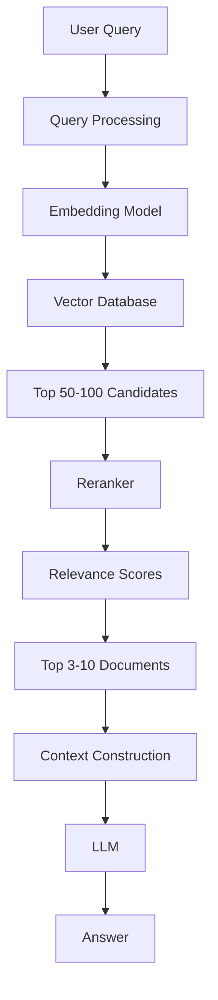
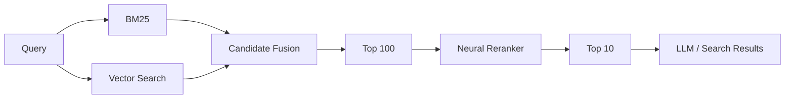

# Awesome-Reranking-API

# Awesome-Reranking-API

# 🔄 Top Reranking APIs & Open-Source Rerankers


> A curated list of **Reranking APIs, hosted reranking platforms, reranking models and open-source software** for improving search, retrieval and RAG relevance.


Rerankers operate as a **second-stage retrieval layer**: an initial retriever produces a larger candidate set, and a reranker scores the query-document pairs to select the most relevant results. Unlike embedding-based retrieval, cross-encoders can jointly evaluate the query and candidate document, generally trading additional latency for higher relevance.


This repository focuses primarily on **open-source and self-hostable reranking software**, while maintaining a separate list of hosted APIs such as Cohere Rerank, Voyage AI Rerank, Jina AI Reranker, Pinecone Rerank, NVIDIA NeMo Retriever, Mixedbread AI and Google Vertex AI Ranking.


---


## 📑 Table of Contents


* [☁️ SaaS/Hosted Platforms](#️-saashosted-platforms)

* [🌍 Open-Source](#-open-source)

* [🎯 Open-Source Reranking Models](#-open-source-reranking-models)

* [🧠 Open-Source Cross-Encoder Rerankers](#-open-source-cross-encoder-rerankers)

* [🔤 Open-Source Multilingual Rerankers](#-open-source-multilingual-rerankers)

* [⚡ Lightweight & CPU Rerankers](#-lightweight--cpu-rerankers)

* [🔢 Open-Source ColBERT Rerankers](#-open-source-colbert-rerankers)

* [🤖 Open-Source LLM Rerankers](#-open-source-llm-rerankers)

* [📝 Open-Source T5 Rerankers](#-open-source-t5-rerankers)

* [🖼️ Open-Source Multimodal Rerankers](#️-open-source-multimodal-rerankers)

* [🛠️ Open-Source Reranking Libraries](#️-open-source-reranking-libraries)

* [🔍 Open-Source Search Engines with Reranking](#-open-source-search-engines-with-reranking)

* [🧩 Commercial Platform → Open-Source Equivalent](#-commercial-platform--open-source-equivalent)

* [🏗️ Reranking Architecture](#️-reranking-architecture)

* [🔄 Open-Source RAG Reranking Architecture](#-open-source-rag-reranking-architecture)

* [⚖️ Commercial vs Open-Source](#️-commercial-vs-open-source)

* [🚀 Recommended Open-Source Stacks](#-recommended-open-source-stacks)

* [📊 Reranker Technology Comparison](#-reranker-technology-comparison)

* [🎯 Recommended Projects by Use Case](#-recommended-projects-by-use-case)

* [🏢 Building a Cohere Rerank Alternative](#-building-a-cohere-rerank-alternative)

* [🌐 Open-Source Reranking Landscape](#-open-source-reranking-landscape)

* [🧠 Why Reranking Matters](#-why-reranking-matters)

* [🤝 Contributing](#-contributing)

* [⚠️ Disclaimer](#️-disclaimer)


---


# ☁️ SaaS/Hosted Platforms


Hosted reranking APIs provide managed inference without requiring GPU infrastructure, model deployment or scaling.


| Platform                                                             | Company                         | Primary Focus             | Key Capabilities                                                  |

| -------------------------------------------------------------------- | ------------------------------- | ------------------------- | ----------------------------------------------------------------- |

| [Cohere Rerank](https://cohere.com/rerank)                           | Cohere                          | General-purpose reranking | Multilingual reranking, search, RAG and semi-structured data      |

| [Voyage AI Rerank](https://www.voyageai.com/)                        | Voyage AI                       | High-quality retrieval    | Reranking, retrieval optimization and domain-oriented models      |

| [Jina AI Reranker](https://jina.ai/reranker/)                        | Jina AI                         | Multilingual reranking    | Text reranking, multilingual retrieval and long-context use cases |

| [Pinecone Rerank](https://www.pinecone.io/)                          | Pinecone                        | Managed retrieval         | Reranking integrated with vector search and RAG                   |

| [NVIDIA NeMo Retriever](https://developer.nvidia.com/nemo-retriever) | NVIDIA                          | Enterprise retrieval      | Embedding, reranking and retrieval optimization                   |

| [Ragatouille](https://github.com/bclavie/RAGatouille)                | Answer.AI / community ecosystem | ColBERT retrieval         | ColBERT-based retrieval and reranking                             |

| [Mixedbread AI](https://www.mixedbread.com/)                         | Mixedbread                      | Retrieval models          | Embedding and reranking APIs                                      |

| [Rerankers.io](https://rerankers.io/)                                | Rerankers                       | Reranking API             | Hosted reranking infrastructure                                   |

| [Google Vertex AI Ranking](https://cloud.google.com/vertex-ai)       | Google Cloud                    | Enterprise ranking        | Ranking and retrieval optimization for search/RAG                 |

| [OpenSearch Neural Search](https://opensearch.org/)                  | OpenSearch                      | Search + neural retrieval | Neural search, hybrid retrieval and reranking                     |

| [Elastic](https://www.elastic.co/)                                   | Elastic                         | Search relevance          | Semantic search, hybrid search and reranking                      |

| [Cerebras](https://www.cerebras.ai/)                                 | Cerebras                        | Fast AI inference         | High-throughput inference for custom reranking workloads          |

| [Together AI](https://www.together.ai/)                              | Together AI                     | Model inference           | Hosted inference for open reranking models                        |

| [Fireworks AI](https://fireworks.ai/)                                | Fireworks AI                    | Model inference           | Hosted inference for open models and custom retrieval stacks      |

| [Hugging Face Inference](https://huggingface.co/inference-api)       | Hugging Face                    | Model inference           | Hosted inference for open reranking models                        |


> **Note:** Reranking products and APIs evolve rapidly. Some platforms offer reranking as part of a broader search/retrieval product rather than as a standalone API.


---


# 🌍 Open-Source


The open-source reranking ecosystem can be divided into several major approaches:


```text

                         RERANKING

                            │

       ┌────────────────────┼────────────────────┐

       │                    │                    │

       ▼                    ▼                    ▼

  Cross-Encoder          ColBERT             LLM Ranking

       │                    │                    │

       ▼                    ▼                    ▼

    BGE-Reranker         ColBERT            RankLLM

    Jina Reranker        RAGatouille        RankGPT

    mxbai-rerank         PyLate             RankZephyr

    MonoT5

       │

       ▼

   Fast / Accurate

```


A particularly useful distinction is between:


* **Pointwise reranking** — score each candidate independently.

* **Pairwise reranking** — compare candidates.

* **Listwise reranking** — rank an entire candidate list.

* **Cross-encoder reranking** — jointly encode query + document.

* **ColBERT-style late interaction** — independently encode tokens and perform efficient interaction.

* **LLM reranking** — use generative language models to reason over candidate documents.


---


# 🎯 Open-Source Reranking Models


| Model / Project                                                                         | Architecture         | Primary Strength                      |

| --------------------------------------------------------------------------------------- | -------------------- | ------------------------------------- |

| [BGE Reranker](https://github.com/FlagOpen/FlagEmbedding)                               | Cross-Encoder        | Strong general-purpose open reranking |

| [BGE-Reranker-v2-m3](https://huggingface.co/BAAI/bge-reranker-v2-m3)                    | Cross-Encoder        | Multilingual reranking                |

| [BGE-Reranker-v2-Gemma](https://huggingface.co/BAAI/bge-reranker-v2-gemma)              | LLM / Cross-Encoder  | Larger multilingual reranking         |

| [mxbai-rerank](https://huggingface.co/mixedbread-ai)                                    | Cross-Encoder        | High-quality open reranking           |

| [Jina Reranker](https://huggingface.co/jinaai)                                          | Cross-Encoder        | Multilingual / long-context retrieval |

| [ColBERT](https://github.com/stanford-futuredata/ColBERT)                               | Late Interaction     | Efficient neural retrieval            |

| [ColBERTv2](https://github.com/stanford-futuredata/ColBERT)                             | Late Interaction     | Strong retrieval and reranking        |

| [MonoT5](https://github.com/castorini/pygaggle)                                         | T5                   | Pointwise reranking                   |

| [RankT5](https://github.com/castorini/pygaggle)                                         | T5                   | Learned ranking                       |

| [RankZephyr](https://github.com/castorini/rank_llm)                                     | LLM                  | Listwise ranking                      |

| [RankGPT](https://github.com/sunnweiwei/RankGPT)                                        | LLM                  | Zero-shot listwise reranking          |

| [RankVicuna](https://github.com/castorini/rank_llm)                                     | LLM                  | LLM-based ranking                     |

| [FlashRank](https://github.com/PrithivirajDamodaran/FlashRank)                          | ONNX / Cross-Encoder | Extremely lightweight local reranking |

| [Sentence Transformers Cross-Encoders](https://github.com/UKPLab/sentence-transformers) | Cross-Encoder        | Broad model ecosystem                 |

| [PyLate](https://github.com/lightonai/pylate)                                           | ColBERT              | Late-interaction retrieval            |

| [LiT5](https://github.com/castorini/rank_llm)                                           | T5 / Listwise        | Listwise reranking                    |


---


# 🧠 Open-Source Cross-Encoder Rerankers


Cross-encoders jointly process the query and candidate document:


```text

Query ───────────┐

                 ├──► Cross-Encoder ──► Relevance Score

Document ────────┘

```


This allows the model to directly evaluate interactions between query and document tokens.


| Model                                                                                                           | Description                               |

| --------------------------------------------------------------------------------------------------------------- | ----------------------------------------- |

| [BAAI/bge-reranker-base](https://huggingface.co/BAAI/bge-reranker-base)                                         | Lightweight BGE cross-encoder             |

| [BAAI/bge-reranker-large](https://huggingface.co/BAAI/bge-reranker-large)                                       | Larger BGE cross-encoder                  |

| [BAAI/bge-reranker-v2-m3](https://huggingface.co/BAAI/bge-reranker-v2-m3)                                       | Multilingual 568M-parameter reranker      |

| [BAAI/bge-reranker-v2-gemma](https://huggingface.co/BAAI/bge-reranker-v2-gemma)                                 | Larger multilingual reranker              |

| [mixedbread-ai/mxbai-rerank-large-v1](https://huggingface.co/mixedbread-ai/mxbai-rerank-large-v1)               | High-capacity reranker                    |

| [mixedbread-ai/mxbai-rerank-base-v1](https://huggingface.co/mixedbread-ai/mxbai-rerank-base-v1)                 | Smaller reranking model                   |

| [jinaai/jina-reranker-v1-turbo-en](https://huggingface.co/jinaai/jina-reranker-v1-turbo-en)                     | Fast English reranker                     |

| [jinaai/jina-reranker-v1-tiny-en](https://huggingface.co/jinaai/jina-reranker-v1-tiny-en)                       | Lightweight English reranker              |

| [Alibaba-NLP/gte-reranker-modernbert-base](https://huggingface.co/Alibaba-NLP/gte-reranker-modernbert-base)     | ModernBERT-based reranking                |

| [Alibaba-NLP/gte-multilingual-reranker-base](https://huggingface.co/Alibaba-NLP/gte-multilingual-reranker-base) | Multilingual reranking                    |

| [maidalun1020/bce-reranker-base_v1](https://huggingface.co/maidalun1020/bce-reranker-base_v1)                   | Bilingual / general reranking             |

| [MS MARCO Cross-Encoders](https://www.sbert.net/docs/pretrained-models/ce-msmarco.html)                         | Large ecosystem of trained ranking models |


The BGE family includes lightweight and larger multilingual rerankers; for example, BGE-Reranker-v2-m3 is documented as a multilingual 568M-parameter cross-encoder.


---


# 🔤 Open-Source Multilingual Rerankers


| Model                                    | Languages / Focus                   |

| ---------------------------------------- | ----------------------------------- |

| **BGE-Reranker-v2-m3**                   | Multilingual                        |

| **BGE-Reranker-v2-Gemma**                | Multilingual                        |

| **BGE-Reranker-v2.5-Gemma2-Lightweight** | Multilingual                        |

| **Jina Reranker**                        | Multilingual                        |

| **GTE Multilingual Reranker**            | Multilingual                        |

| **mxbai-rerank**                         | Primarily English-oriented variants |

| **ColBERT multilingual models**          | Model-dependent                     |

| **XLM-R-based Cross-Encoders**           | Multilingual                        |

| **LaBSE-based ranking models**           | Multilingual                        |


For multilingual retrieval, BGE-Reranker-v2-m3 is one of the most useful open models to evaluate first.


---


# ⚡ Lightweight & CPU Rerankers


Not every application needs a multi-billion-parameter reranker.


| Project                                                                      | Approach      | Strength                       |

| ---------------------------------------------------------------------------- | ------------- | ------------------------------ |

| [FlashRank](https://github.com/PrithivirajDamodaran/FlashRank)               | ONNX          | Very lightweight CPU inference |

| [BGE-Reranker-base](https://huggingface.co/BAAI/bge-reranker-base)           | Cross-Encoder | Smaller BGE model              |

| [Jina Tiny Reranker](https://huggingface.co/jinaai/jina-reranker-v1-tiny-en) | Cross-Encoder | Low resource requirements      |

| [MS MARCO MiniLM](https://huggingface.co/cross-encoder)                      | Cross-Encoder | Fast ranking                   |

| [Sentence Transformers](https://github.com/UKPLab/sentence-transformers)     | Cross-Encoder | Efficient local inference      |

| [ONNX Runtime](https://github.com/microsoft/onnxruntime)                     | Runtime       | Optimized model execution      |


FlashRank is specifically designed around lightweight reranking and ONNX-optimized inference, making it useful when CPU latency and deployment simplicity matter.


---


# 🔢 Open-Source ColBERT Rerankers


ColBERT uses **late interaction** rather than processing the entire query-document pair through one traditional cross-encoder.


```text

                 Query

                   │

                   ▼

             Query Encoder

                   │

             Token Embeddings

                   │

                   ▼

              ┌─────────┐

              │ MaxSim  │

              └────┬────┘

                   │

       ┌───────────┼───────────┐

       ▼           ▼           ▼

    Document A  Document B  Document C

       │           │           │

       └───────────┼───────────┘

                   │

                   ▼

                 Ranking

```


| Project                                                           | Description                                      |

| ----------------------------------------------------------------- | ------------------------------------------------ |

| [ColBERT](https://github.com/stanford-futuredata/ColBERT)         | Original late-interaction retrieval architecture |

| [ColBERTv2](https://github.com/stanford-futuredata/ColBERT)       | Improved compressed late-interaction retrieval   |

| [RAGatouille](https://github.com/bclavie/RAGatouille)             | Easy ColBERT/RAG integration                     |

| [PyLate](https://github.com/lightonai/pylate)                     | Modern ColBERT toolkit                           |

| [PLAID](https://github.com/stanford-futuredata/ColBERT)           | Efficient ColBERT indexing/retrieval             |

| [AnswerDotAI rerankers](https://github.com/AnswerDotAI/rerankers) | Unified interface including ColBERT              |

| [Tevatron](https://github.com/texttron/tevatron)                  | Retrieval model training framework               |


---


# 🤖 Open-Source LLM Rerankers


Instead of producing a scalar score directly, an LLM can reason over candidate documents and produce an ordering.


```text

Query

  │

  ▼

Candidate Documents

  │

  ├── Document A

  ├── Document B

  ├── Document C

  ├── Document D

  └── Document E

  │

  ▼

LLM Ranker

  │

  ▼

Ordered Results

```


| Project                                                             | Description                                    |

| ------------------------------------------------------------------- | ---------------------------------------------- |

| [RankLLM](https://github.com/castorini/rank_llm)                    | Framework for LLM-based ranking                |

| [RankGPT](https://github.com/sunnweiwei/RankGPT)                    | Zero-shot listwise reranking                   |

| [RankZephyr](https://github.com/castorini/rank_llm)                 | Zephyr-based ranking                           |

| [RankVicuna](https://github.com/castorini/rank_llm)                 | Vicuna-based ranking                           |

| [LiT5](https://github.com/castorini/rank_llm)                       | Listwise T5 ranking                            |

| [LLM Layerwise Rerankers](https://github.com/AnswerDotAI/rerankers) | Layerwise ranking approaches                   |

| [Rerankers](https://github.com/AnswerDotAI/rerankers)               | Unified API for multiple ranking architectures |


LLM reranking can be particularly useful when relevance requires deeper semantic reasoning, although it generally has higher inference cost and latency than compact cross-encoders.


---


# 📝 Open-Source T5 Rerankers


T5-style models can be trained to predict relevance for query-document pairs or perform listwise ranking.


| Project / Model                                      | Description            |

| ---------------------------------------------------- | ---------------------- |

| [MonoT5](https://github.com/castorini/pygaggle)      | Pointwise T5 reranking |

| [DuoT5](https://github.com/castorini/pygaggle)       | Pairwise T5 reranking  |

| [RankT5](https://github.com/castorini/pygaggle)      | T5 ranking models      |

| [InRanker](https://github.com/AnswerDotAI/rerankers) | T5-based ranking       |

| [LiT5](https://github.com/castorini/rank_llm)        | Listwise T5 reranking  |

| [PyGaggle](https://github.com/castorini/pygaggle)    | Neural ranking toolkit |


---


# 🖼️ Open-Source Multimodal Rerankers


Document and multimodal search increasingly require ranking based on both text and visual information.


| Project / Model                                                 | Description                                       |

| --------------------------------------------------------------- | ------------------------------------------------- |

| [MonoVLMRanker](https://github.com/AnswerDotAI/rerankers)       | Multimodal VLM reranking                          |

| [ColPali](https://github.com/illuin-tech/colpali)               | Vision-language late-interaction retrieval        |

| [ColQwen](https://github.com/illuin-tech/colpali)               | Vision-language retrieval                         |

| [PaliGemma](https://huggingface.co/google/paligemma-3b-mix-448) | Multimodal model usable in custom ranking systems |

| [Qwen-VL](https://github.com/QwenLM/Qwen3-VL)                   | Multimodal reasoning                              |

| [InternVL](https://github.com/OpenGVLab/InternVL)               | Multimodal model family                           |


Multimodal reranking is particularly useful for:


* PDF pages

* Slides

* Charts

* Screenshots

* Product images

* Scanned documents

* Tables

* Visual search


---


# 🛠️ Open-Source Reranking Libraries


## ⭐ Rerankers


[rerankers](https://github.com/AnswerDotAI/rerankers) provides a unified interface across many reranking approaches, including cross-encoders, T5, ColBERT, FlashRank, LLM ranking and several hosted APIs.


```python

from rerankers import Reranker


ranker = Reranker(

    "BAAI/bge-reranker-v2-m3",

    model_type="cross-encoder"

)


results = ranker.rank(

    query="What is retrieval augmented generation?",

    docs=[

        "RAG combines retrieval with language models.",

        "Transformers are neural network architectures.",

        "Vector databases store embeddings."

    ]

)


top_results = results.top_k(3)

```


The library can also switch between local and API-backed rerankers using a common interface.


---


## Sentence Transformers


[Sentence Transformers](https://github.com/UKPLab/sentence-transformers) provides one of the most widely used ecosystems for cross-encoder reranking.


```python

from sentence_transformers import CrossEncoder


model = CrossEncoder(

    "BAAI/bge-reranker-v2-m3"

)


scores = model.predict([

    [

        "What is RAG?",

        "RAG combines retrieval with language models."

    ],

    [

        "What is RAG?",

        "Transformers are neural network architectures."

    ]

])

```


Cross-encoders directly score query-document pairs and are a standard approach for reranking retrieved candidates.


---


## FlagEmbedding


[FlagEmbedding](https://github.com/FlagOpen/FlagEmbedding) provides BGE embeddings and reranking models.


```python

from FlagEmbedding import FlagReranker


reranker = FlagReranker(

    "BAAI/bge-reranker-v2-m3",

    use_fp16=True

)


score = reranker.compute_score([

    "What is RAG?",

    "RAG combines retrieval with language models."

])

```


The BGE project documents dedicated reranking models including BGE-Reranker-v2-m3 and larger multilingual variants.


---


## FlashRank


[FlashRank](https://github.com/PrithivirajDamodaran/FlashRank) is focused on small, fast rerankers and CPU-friendly inference.


Best suited for:


* Edge deployments

* CPU-only environments

* Low-cost APIs

* High-throughput lightweight ranking

* Serverless-style workloads


---


## RankLLM


[RankLLM](https://github.com/castorini/rank_llm) focuses on LLM-based ranking and supports listwise and pairwise ranking approaches.


Useful when:


* Semantic reasoning matters

* Candidate sets are relatively small

* Ranking quality is more important than latency

* An LLM is already available in the stack


---


## PyLate


[PyLate](https://github.com/lightonai/pylate) provides tools for ColBERT-style late-interaction retrieval.


Best suited for:


* Large-scale retrieval

* Late-interaction architectures

* Efficient semantic ranking

* ColBERT-style systems


---


## PyTerrier


[PyTerrier](https://github.com/terrier-org/pyterrier) provides an information-retrieval experimentation framework with extensive ranking and reranking support.


Useful for:


* IR experiments

* Benchmarking

* Learning-to-rank

* Pipeline experimentation

* Academic research


---


# 🔍 Open-Source Search Engines with Reranking


Reranking does not have to exist as a standalone API.


Modern search engines can integrate ranking directly into the retrieval pipeline.


| Project                                                        | Capabilities                                     |

| -------------------------------------------------------------- | ------------------------------------------------ |

| [OpenSearch](https://github.com/opensearch-project/OpenSearch) | Hybrid search, neural search, semantic reranking |

| [Vespa](https://github.com/vespa-engine/vespa)                 | Multi-phase ranking, tensors and neural ranking  |

| [Apache Solr](https://solr.apache.org/)                        | Search + learning-to-rank + vector retrieval     |

| [Apache Lucene](https://lucene.apache.org/)                    | Core search and ranking infrastructure           |

| [Weaviate](https://github.com/weaviate/weaviate)               | Vector search + hybrid retrieval + reranking     |

| [Qdrant](https://github.com/qdrant/qdrant)                     | Vector retrieval and reranking pipelines         |

| [Milvus](https://github.com/milvus-io/milvus)                  | Vector search and hybrid retrieval               |

| [Elasticsearch](https://github.com/elastic/elasticsearch)      | Search, vector retrieval and relevance pipelines |

| [Typesense](https://github.com/typesense/typesense)            | Search and semantic retrieval                    |

| [Meilisearch](https://github.com/meilisearch/meilisearch)      | Search and semantic retrieval                    |


---


# 🧩 Commercial Platform → Open-Source Equivalent


| Commercial Platform              | Open-Source Equivalent / Building Blocks                   |

| -------------------------------- | ---------------------------------------------------------- |

| **Cohere Rerank**                | BGE-Reranker-v2-m3 + Sentence Transformers / FlagEmbedding |

| **Voyage AI Rerank**             | BGE + mxbai-rerank + Jina open models                      |

| **Jina AI Reranker**             | Jina open reranker models + Sentence Transformers          |

| **Pinecone Rerank**              | Cross-Encoder + Qdrant / OpenSearch / Vespa                |

| **NVIDIA NeMo Retriever**        | BGE / mxbai + TensorRT-LLM / vLLM                          |

| **Ragatouille API**              | ColBERT + RAGatouille + PyLate                             |

| **Mixedbread AI**                | mxbai-rerank models + Sentence Transformers                |

| **Rerankers.io**                 | Rerankers + local cross-encoder                            |

| **Google Vertex AI Ranking**     | BGE + Sentence Transformers + Vespa / OpenSearch           |

| **OpenSearch Neural Search**     | OpenSearch Neural Search itself + open reranker models     |

| **Elastic Reranking**            | Elasticsearch/OpenSearch + BGE + cross-encoder             |

| **Hosted Reranking API**         | FastAPI + Sentence Transformers + GPU inference            |

| **Enterprise Reranking Service** | vLLM / TEI + BGE / mxbai / Jina + FastAPI                  |


---


# 🏗️ Reranking Architecture


The standard two-stage retrieval architecture is:


```text

                           User Query

                               │

                               ▼

                     ┌──────────────────┐

                     │  Initial Search  │

                     └────────┬─────────┘

                              │

                              ▼

                    Top 50–100 Candidates

                              │

                              ▼

                     ┌──────────────────┐

                     │    Reranker      │

                     └────────┬─────────┘

                              │

                              ▼

                       Top 5–10 Results

                              │

                              ▼

                            LLM

```


The initial retriever prioritizes **speed and recall**.


The reranker prioritizes **precision and relevance**.


---


# 🔄 Open-Source RAG Reranking Architecture





---


# 🧠 Hybrid Search + Reranking


Reranking becomes even more powerful when lexical and semantic retrieval are combined.





Example:


```text

BM25

 +

Dense Vector Search

 +

RRF / Candidate Fusion

 +

Cross-Encoder Reranker

 =

High-Quality Retrieval

```


---


# ⚖️ Commercial vs Open-Source


| Capability          | Hosted Reranker    | Open-Source Reranker  |

| ------------------- | ------------------ | --------------------- |

| API                 | ✅                  | Build yourself        |

| GPU Management      | Vendor             | Self-managed          |

| Scaling             | Managed            | Self-managed          |

| Model Selection     | Limited            | Very High             |

| Fine-Tuning         | Varies             | ✅                     |

| Data Privacy        | Vendor-dependent   | Full control          |

| Air-Gapped          | Usually difficult  | ✅                     |

| Cost                | Per request/token  | Infrastructure        |

| Latency             | Predictable        | Tunable               |

| Custom Models       | Limited            | ✅                     |

| Open Weights        | Usually no         | Often                 |

| Self Hosting        | Limited            | ✅                     |

| Vendor Lock-In      | Higher             | Lower                 |

| Observability       | Usually integrated | Build / integrate     |

| Benchmarking        | Vendor-dependent   | Full control          |

| Domain Adaptation   | Limited / varies   | ✅                     |

| Multilingual Models | Available          | Many choices          |

| Multimodal Ranking  | Emerging           | Increasingly possible |


---


# 📊 Reranker Technology Comparison


| Reranker              | Architecture     |      Local      |   Multilingual  |   CPU-Friendly  |   Long Context  |    LLM-Based    |

| --------------------- | ---------------- | :-------------: | :-------------: | :-------------: | :-------------: | :-------------: |

| Cohere Rerank         | API              |        ❌        |        ✅        |       N/A       |        ✅        |   Proprietary   |

| Voyage Rerank         | API              |        ❌        | Model-dependent |       N/A       |        ✅        |   Proprietary   |

| Jina Reranker         | API / Models     |        ✅        |        ✅        | Model-dependent |        ✅        |        No       |

| Pinecone Rerank       | API              |        ❌        | Model-dependent |       N/A       | Model-dependent |        No       |

| NVIDIA NeMo Retriever | API / Enterprise | Model-dependent |        ✅        |   GPU-oriented  |        ✅        | Model-dependent |

| Mixedbread Rerank     | API / Models     |        ✅        | Model-dependent | Model-dependent | Model-dependent |        No       |

| BGE-Reranker-v2-m3    | Cross-Encoder    |        ✅        |        ✅        |        ⚠️       | Model-dependent |        No       |

| BGE-Reranker-v2-Gemma | Cross-Encoder    |        ✅        |        ✅        |        ❌        | Model-dependent |       Yes       |

| mxbai-rerank          | Cross-Encoder    |        ✅        | Model-dependent |        ⚠️       | Model-dependent |        No       |

| Jina Reranker Models  | Cross-Encoder    |        ✅        |        ✅        | Model-dependent |        ✅        |        No       |

| ColBERT               | Late Interaction |        ✅        | Model-dependent |        ⚠️       | Model-dependent |        No       |

| FlashRank             | ONNX             |        ✅        | Model-dependent |        ✅        | Model-dependent |        No       |

| MonoT5                | T5               |        ✅        | Model-dependent |        ⚠️       | Model-dependent |        No       |

| RankLLM               | LLM              |     ✅ / API     | Model-dependent |        ❌        |        ✅        |        ✅        |


---


# 🚀 Recommended Open-Source Stacks


## 🏆 1. Best General-Purpose Reranker


```text

Sentence Transformers

        +

BGE-Reranker-v2-m3

        +

FastAPI

        +

GPU

```


A strong starting point for self-hosted semantic reranking.


---


## ⚡ 2. CPU-Only Reranking


```text

FlashRank

   +

ONNX Runtime

   +

FastAPI

```


Best when GPU infrastructure is unavailable.


---


## 🌍 3. Multilingual Reranking


```text

BGE-Reranker-v2-m3

        +

FlagEmbedding

        +

FastAPI

```


BGE-Reranker-v2-m3 is explicitly designed as a multilingual reranker.


---


## 🔢 4. Large-Scale Retrieval


```text

Vector Database

      +

ColBERT

      +

PLAID

      +

PyLate

```


Useful when candidate collections are large and late-interaction retrieval is desirable.


---


## 🤖 5. LLM Reranking


```text

Vector Search

      +

Top 20 Candidates

      +

RankLLM

      +

vLLM

      +

Final Top 5

```


Best when semantic reasoning matters more than raw latency.


---


## 🧠 6. Hybrid Production RAG


```text

              Query

                │

        ┌───────┴───────┐

        ▼               ▼

      BM25          Vector Search

        │               │

        └───────┬───────┘

                ▼

             RRF

                │

                ▼

          Top 100 Docs

                │

                ▼

       BGE Reranker v2

                │

                ▼

            Top 10

                │

                ▼

              LLM

```


---


# 🏢 Building a Cohere Rerank Alternative


A minimal self-hosted reranking API can be built with:


```text

                     Client

                       │

                       ▼

                  FastAPI

                       │

                       ▼

              Request Validation

                       │

                       ▼

             BGE / mxbai Model

                       │

                       ▼

              Query + Documents

                       │

                       ▼

                 GPU Inference

                       │

                       ▼

                Relevance Scores

                       │

                       ▼

                 Sorted Results

```


Example API:


```text

POST /rerank


{

  "query": "What is RAG?",

  "documents": [

    "RAG combines retrieval and generation.",

    "Transformers are neural networks.",

    "Databases store information."

  ],

  "top_n": 2

}

```


Possible response:


```json

{

  "results": [

    {

      "index": 0,

      "relevance_score": 0.97

    },

    {

      "index": 1,

      "relevance_score": 0.12

    }

  ]

}

```


---


# 🏗️ Production Reranking Service


```text

                         API Gateway

                              │

                              ▼

                         Load Balancer

                              │

                    ┌─────────┴─────────┐

                    │                   │

                    ▼                   ▼

                Reranker 1          Reranker 2

                    │                   │

                    └─────────┬─────────┘

                              │

                         GPU Workers

                              │

                    ┌─────────┴─────────┐

                    │                   │

                    ▼                   ▼

                  BGE                mxbai

                              │

                              ▼

                         Redis Cache

                              │

                              ▼

                       Observability

```


Useful infrastructure:


```text

FastAPI

+

vLLM / Text Embeddings Inference / ONNX Runtime

+

BGE / mxbai / Jina Models

+

Redis

+

Prometheus

+

Grafana

+

Kubernetes

```


---


# 📈 Reranking Evaluation


Rerankers should be evaluated on the **actual retrieval distribution**, not merely model-card benchmarks.


Important metrics include:


| Metric              | Purpose                          |

| ------------------- | -------------------------------- |

| NDCG@k              | Ranking quality                  |

| MRR@k               | First relevant result            |

| Recall@k            | Candidate coverage               |

| Precision@k         | Relevance of returned results    |

| MAP                 | Average ranking quality          |

| Hit Rate            | Whether relevant content appears |

| Latency             | Ranking speed                    |

| Throughput          | Documents ranked per second      |

| GPU Memory          | Deployment requirements          |

| Cost / 1M Documents | Operational economics            |


A useful evaluation pipeline:


```text

Production Queries

       │

       ▼

Candidate Retrieval

       │

       ▼

┌──────┼───────────────┐

│      │               │

BGE   Jina          Cohere

│      │               │

└──────┼───────────────┘

       │

       ▼

NDCG / MRR / Recall

       │

       ▼

Latency + Cost

       │

       ▼

Production Selection

```


---


# 🎯 Recommended Projects by Use Case


| Use Case                          | Recommended Starting Point    |

| --------------------------------- | ----------------------------- |

| Best general open-source reranker | **BGE-Reranker-v2-m3**        |

| Multilingual reranking            | **BGE-Reranker-v2-m3**        |

| High-quality large model          | **BGE-Reranker-v2-Gemma**     |

| Lightweight CPU ranking           | **FlashRank**                 |

| Easy cross-encoder deployment     | **Sentence Transformers**     |

| Unified reranking API             | **rerankers**                 |

| ColBERT retrieval                 | **RAGatouille / PyLate**      |

| Large-scale late interaction      | **ColBERT / PLAID**           |

| LLM reranking                     | **RankLLM**                   |

| Zero-shot LLM ranking             | **RankGPT**                   |

| T5 reranking                      | **MonoT5 / RankT5**           |

| RAG experimentation               | **rerankers**                 |

| IR experimentation                | **PyTerrier**                 |

| Search engine reranking           | **Vespa / OpenSearch / Solr** |

| Hybrid search                     | **OpenSearch / Vespa**        |

| Multimodal ranking                | **ColPali / MonoVLMRanker**   |

| GPU production API                | **BGE / mxbai + vLLM/TEI**    |

| CPU production API                | **FlashRank + ONNX Runtime**  |


---


# 🌐 Open-Source Reranking Landscape


```mermaid

mindmap

  root((Reranking))

    Cross Encoders

      BGE Reranker

      mxbai-rerank

      Jina Reranker

      GTE Reranker

      MS MARCO

      MiniLM

    ColBERT

      ColBERT

      ColBERTv2

      RAGatouille

      PyLate

      PLAID

    T5

      MonoT5

      DuoT5

      RankT5

      LiT5

    LLM Ranking

      RankLLM

      RankGPT

      RankZephyr

      RankVicuna

    Lightweight

      FlashRank

      ONNX Runtime

      MiniLM

    Multimodal

      ColPali

      ColQwen

      MonoVLM

      Qwen-VL

      InternVL

    Libraries

      Sentence Transformers

      FlagEmbedding

      Rerankers

      PyTerrier

      PyGaggle

    Search

      OpenSearch

      Vespa

      Solr

      Lucene

      Weaviate

    Applications

      RAG

      Semantic Search

      Enterprise Search

      Question Answering

      Recommendations

```


---


# 🔥 Why Reranking Matters


A typical vector search pipeline might retrieve:


```text

Top 100 Candidates

```


But only a small subset may actually answer the user's question.


Reranking adds a second relevance filter:


```text

                         Query

                           │

                           ▼

                    Vector Search

                           │

                           ▼

                     100 Candidates

                           │

                           ▼

                      Reranker

                           │

                           ▼

                      10 Results

                           │

                           ▼

                          LLM

```


This makes it possible to use:


* Fast retrieval for **high recall**

* Neural reranking for **high precision**

* LLM generation for **reasoned answers**


The resulting architecture is often:


```text

Recall

  ↑

  │

  │       Vector Search

  │            │

  │            ▼

  │       Candidate Set

  │            │

  │            ▼

  │        Reranking

  │            │

  │            ▼

  │        Final Set

  │            │

  │            ▼

  │           LLM

  │

  └──────────────────────────► Precision

```


---


# 🧠 Reranking vs Embedding Retrieval


| Property         | Embedding Retrieval       | Reranking                          |

| ---------------- | ------------------------- | ---------------------------------- |

| Query Processing | Separate embedding        | Joint query-document scoring       |

| Main Goal        | Recall                    | Precision                          |

| Candidate Count  | Large                     | Small                              |

| Latency          | Low                       | Higher                             |

| Accuracy         | Good                      | Usually higher on final candidates |

| Precomputation   | Documents can be embedded | Usually requires inference         |

| Typical Position | First stage               | Second stage                       |

| GPU Requirement  | Optional                  | Often useful                       |

| RAG Role         | Candidate retrieval       | Final context selection            |


---


# 🧩 Recommended Two-Stage Retrieval


```text

                 User Query

                     │

                     ▼

             ┌───────────────┐

             │ BM25 / Vector │

             └───────┬───────┘

                     │

                     ▼

                 Top 100

                     │

                     ▼

             ┌───────────────┐

             │    Reranker   │

             └───────┬───────┘

                     │

                     ▼

                  Top 10

                     │

                     ▼

             ┌───────────────┐

             │      LLM      │

             └───────┬───────┘

                     │

                     ▼

                   Answer

```


This architecture is particularly useful for:


* Enterprise RAG

* Enterprise search

* Knowledge bases

* Customer-support search

* Legal search

* Financial research

* Code search

* Scientific literature

* E-commerce search

* Recommendation systems


---


# 🤝 Contributing


Contributions are welcome!


Please consider adding:


* New reranking APIs

* Open-source reranking models

* Cross-encoders

* ColBERT models

* T5 rankers

* LLM rankers

* Multilingual rerankers

* Multimodal rerankers

* CPU-optimized rerankers

* GPU inference servers

* Search-engine integrations

* RAG integrations

* Benchmark datasets

* Ranking benchmarks

* Fine-tuning frameworks

* Evaluation tools

* Production deployment examples


When adding a project, please verify its **current license**, model-weight terms and commercial-use restrictions.


---


# ⚠️ Disclaimer


This repository is an independent technical curation and is **not affiliated with or endorsed by any company or project listed here**.


Reranking performance varies significantly according to:


* Query distribution

* Candidate retrieval quality

* Document length

* Language

* Domain

* Candidate count

* Context length

* Model size

* Hardware

* Quantization

* Batch size

* Inference implementation


Benchmark results should therefore be treated as a starting point rather than a universal ranking of models.


Licensing can also differ between:


* Source code

* Model weights

* Training data

* Commercial use

* Hosted deployment

* Redistribution


Always verify the current license and model terms before commercial deployment.


---


## ⭐ Star This Repository


If you are interested in:


* Reranking

* Neural Search

* Semantic Search

* RAG

* Enterprise Search

* Cross-Encoders

* ColBERT

* LLM Ranking

* Retrieval

* Open-Source AI


consider giving this repository a ⭐ **Star** and contributing new projects.


---


**Last updated: September 2026**
